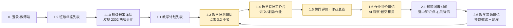

# 教学科研实训一体化平台 · 页面设计文档

> 本文档用于串起产品演示用的全部页面：功能目的 / 进入路径 / 布局示意 / 核心组件 / 假数据引用 / 状态变体。
> 配套假数据详见 `./mock-data/` 目录，类型真源为 `./mock-data/types.ts`。

---

## 0. 全局说明

### 0.1 产品定位与主故事线

**产品定位**：面向高校的"教学 · 科研 · 实训"一体化 AI 教学平台。围绕"专业 → 学科 → 课程"体系，把 **知识图谱**、**教学计划与设计**、**协同评价**、**学情分析**、**课程/资源/实训库** 一体化打通，让教师团队借助 AI 进行以学情为驱动的精细化教学。

**本 Demo 的主故事线**（演示主讲人带着观众一路走的故事）：

> 李建国（机械工程学院 · 制图教研室主任）在 2026 春季学期为机制 2301 和 2302 两个班同时开设《机械制图与CAD》课程。
> 在第 3 章"正投影法与三视图"的第 2 节"组合体三视图绘制"之前，他使用 **学情分析** 查看 2301/2302 两班的画像，发现 **2302 班两极分化严重**；随即在 **教学计划** 里为该小节设计了更细致的教学策略，然后在 **教学设计工作台** 借助 AI 生成讲义、课堂 PPT、作业与配套实训；课后通过 **协同评价** 的作业评价总览发现 **「截交线与相贯线」43% 错误率** 集中错题，AI 建议扩展 3.4 节为 3 课时；接下来在 **知识图谱/资源库** 快速找到对应节点挂载的微课与题库，完成闭环。

**非主线场景**（演示平台通用性，分布在各列表/详情页）：

| 专业 | 课程 | 教师 | 班级 | 演示价值 |
|---|---|---|---|---|
| 法学 | 《民法典总则编》 | 赵文静 | 法学 2301 | 文科案例教学、图谱形态差异 |
| 护理学 | 《基础护理学》 | 王丽华 | 护理 2301 | 医学实训导向、实训项目库 |
| 学前教育 | 《幼儿园教育活动设计》 | 孙小艳 | 学前 2301 | **未建图谱** 空状态演示 |

### 0.2 全局布局

```
┌─────────────────────────────────────────────────────────────┐
│ 顶部导航：Logo | [智慧教学 ▼] [专业知识引擎 ▼]     身份切换 ▼ 用户头像 │
├──────────────┬──────────────────────────────────────────────┤
│ 侧边栏        │ 主内容区                                        │
│ （二级菜单）  │                                              │
│              │                                              │
│              │                                              │
└──────────────┴──────────────────────────────────────────────┘
```

- **顶部导航**：平台 Logo + 两个一级模块 + 身份切换（**教师端**/学生端占位）
- **侧边栏**：随所选模块展开对应二级菜单，如"教学计划 / 教学设计 / 协同评价 / 学情分析"
- **身份切换**：Demo 阶段默认以"李建国老师"教师身份登录，学生端仅保留入口占位不实现

### 0.3 公共组件约定

| 组件 | 使用场景 | 视觉要点 |
|---|---|---|
| **空状态卡** | 无数据、未建图谱等 | 灰度插画 + 一句说明 + 主动行动按钮（如"立即创建"） |
| **AI 生成标识** | 所有由 AI 生成的产物 | 左上角紫色星形角标 `AI 生成` |
| **操作气泡** | 行内快捷操作 | 悬浮出现，最多 3 个按钮 |
| **筛选栏** | 列表类页面 | 顶部横条：搜索 + 多维筛选 + 排序 + 视图切换（卡片/列表） |
| **进度条 / 状态标签** | 教学计划、实训项目 | `草稿` 灰 / `进行中` 蓝 / `已完成` 绿 / `异常` 橙 |
| **雷达图 · 分布直方图** | 学情画像 | 配色统一使用品牌主蓝 + 辅灰，支持 hover 显示数值 |
| **图谱网络图** | 专业知识引擎·知识图谱 | 同心分层 SVG：**素养→能力→知识点**；节点圆形并按层级着色；选中节点右侧详情面板 |

### 0.4 阅读指引：演示动线图



---

# 1. 智慧教学模块

## 1.1 教学计划列表

**页面目的**：教师查看和管理所有教学计划。

**进入路径**：顶部导航 · 智慧教学 → 侧边栏 · 教学计划

**布局示意**：

```
┌───────────────────────────────────────────────────────────────┐
│ 教学计划                                     [+ 新建教学计划]    │
├───────────────────────────────────────────────────────────────┤
│ [搜索]  [学期 ▼] [课程 ▼] [状态 ▼] [班级 ▼]     [卡片|列表]    │
├───────────────────────────────────────────────────────────────┤
│ ┌─────────────────────┐ ┌─────────────────────┐                │
│ │《机械制图与CAD》     │ │《民法典总则编》     │                │
│ │ 2026春 · 机制2301/02 │ │ 2026春 · 法学2301   │                │
│ │ 进行中 █████░  60%  │ │ 进行中 ███░░  40%   │                │
│ │ 李建国 · 64 学时     │ │ 赵文静 · 48 学时    │                │
│ │ [查看详情] [继续编辑] │ │ [查看详情]         │                │
│ └─────────────────────┘ └─────────────────────┘                │
│ ┌─────────────────────┐ ┌─────────────────────┐                │
│ │《基础护理学》(草稿)  │ │《机械制图与CAD》     │                │
│ │ 2026春 · 护理2301    │ │ 2025春 · 机制2201    │                │
│ │ 草稿                 │ │ 已完成 ██████ 100%  │                │
│ │ 王丽华               │ │ 李建国               │                │
│ └─────────────────────┘ └─────────────────────┘                │
└───────────────────────────────────────────────────────────────┘
```

**关键组件/按钮**：

- 顶部：`+ 新建教学计划`（向导入口）
- 筛选栏：学期 / 课程 / 状态 / 班级 / 关键字
- 卡片：标题、课程、学期、班级、进度条、状态标签、创建者、学时
- 卡片行内操作：查看详情 / 继续编辑 / 复制 / 归档 / 删除

**状态变体**：

- 空状态：暂无教学计划 → 显示向导引导卡
- 正常：4 条数据排满
- 异常：有 1 个`草稿`待完成、有 1 个`进行中`标注红色风险提示（如截止日期临近但小节未完成）

**使用的假数据**：`teachingPlans`（4 条）+ `courses` + `classes` + `teachers`

**三层图谱联动（新增）**：

- 凡 `derivedFromL2PlanId` 非空的计划卡片，在右下角显示「派生自《xxx 标准课程计划》」灰色角标；点击打开对应 **课程详情（2.4）** 中「知识图谱映射」或标准计划来源说明（L2 数据在 mock 中；**不在** 2.1 知识图谱主页画布上展开）。
- 角标样式：同已有 AI 生成角标，颜色改为中性灰（沿用 `草稿` 灰）+ 链接图标

---

## 1.2 教学计划创建向导

**页面目的**：分步引导教师创建一个新的教学计划。

**进入路径**：1.1 教学计划列表 · 点击"新建教学计划"

**向导步骤**（水平步骤条）：

```
[1 选择学科/专业] → [2 班级选择 + 学情预览] → [3 教学策略] → [4 预览并生成]
```

### 步骤 1 · 选择学科/专业/课程

- 三级联动下拉：专业 → 学科 → 课程
- 选中课程后右侧显示课程预览卡（封面、学时、已挂载图谱节点数）

### 步骤 2 · 班级选择 + 学情预览

```
┌──────────────────────────────────┬───────────────────────┐
│ 已选：机制2301 + 机制2302         │ 班级画像快览           │
│ [+] 机制2301 · 28 人 · 中上水平   │ ┌─ 2301 雷达 ────┐    │
│ [+] 机制2302 · 25 人 · 两极分化   │ │ 基础82 空间76  │    │
│ [ ] 机制2201 · 26 人 · 已结业     │ │ 规范80 综合72  │    │
│                                   │ │ 探究70 协作78  │    │
│                                   │ └───────────────┘    │
│                                   │ ⚠️ 2302 分布两极分化   │
└──────────────────────────────────┴───────────────────────┘
```

- 班级可多选
- 右侧自动读取班级画像（`classProfiles`）做预览，并高亮风险点

### 步骤 3 · 教学策略

- 显示平台预置 + 院系共享 + 个人 共 6 条策略卡
- 鼠标移至某条策略时，下方出现 `AI 推荐` 徽标（基于班级画像计算匹配度，如"匹配度 92%"）
- 选定后显示策略详情（节奏 / 难度 / 活动建议）
- 支持"基于策略调整"打开编辑抽屉

### 步骤 4 · 预览并生成

- 左：章节-小节结构（AI 自动生成骨架，允许拖拽调序）
- 右：每个小节已自动挂接的图谱节点 + 估算学时
- 底部：`返回上一步` `生成并保存为草稿` `生成并立即开始`

**使用的假数据**：`professions` / `subjects` / `courses` / `classes` / `classProfiles` / `teachingStrategies`

**三层图谱联动（新增）**：

步骤 1 新增分支入口"基于岗位 / L2 标准计划生成"：
- 选择课程后，若该课程已有对应 L2 标准课程计划（`l2StandardCoursePlans`），步骤 1 右侧课程预览卡底部出现"使用标准课程计划作为基础"开关；打开后步骤 4 的章-节骨架直接预填标准计划内容
- 若选择从"岗位驱动"生成，跳转到 2.2.5 岗位驱动生成页完成后推送回步骤 4

步骤 4 新增差异展示区：
- 当基于 L2 标准计划时，步骤 4 右侧显示"对标准计划的调整（overrides）"小面板，已调整项以橙色高亮显示调整前/后值与原因；无调整则显示"与标准计划一致"

---

## 1.3 教学计划详情

**页面目的**：可视化查看一个教学计划的完整教学路径，并跳转到任意小节进行教学设计。

**进入路径**：1.1 列表页 · 点击卡片

**布局示意**：

```
┌─────────────────────────────────────────────────────────────────┐
│ ← 返回       《机械制图与CAD》· 2026春 · 机制2301+2302   [编辑]  │
├─────────────────────────────────────────────────────────────────┤
│ 基础信息 | 教学路径 | 策略详情 | AI 建议                         │
├─────────────────────────────────────────────────────────────────┤
│ 日期区间 2026-02-23 → 2026-06-19     64 学时    状态：进行中 60% │
│ 覆盖班级：机制 2301（28）、机制 2302（25）                         │
│ 策略：李建国 · 2301 班定制                                        │
├─────────────────────────────────────────────────────────────────┤
│ ◆ 教学路径（时间线）                                              │
│                                                                 │
│  第1章 制图基础           ●──2/23 1.1──●──2/25 1.2              │
│  第2章 投影基础           ●──3/02 2.1──●──3/04 2.2──●──3/09 2.3 │
│  第3章 正投影【焦点】★    ●──3/16 3.1──●──3/18 3.2 ★──●──3/23...│
│  ...                                                             │
│                                                                 │
│  点击任意小节节点 → 跳转到 1.4 教学设计工作台                     │
└─────────────────────────────────────────────────────────────────┘
```

**关键组件/按钮**：

- Tab：`基础信息` `教学路径` `策略详情` `AI 建议`
- 教学路径：左右滚动的时间线，章节为横向泳道，每个小节为一个可点击节点；节点上显示日期、是否已做教学设计（已完成绿色 / 未完成灰色）
- 侧边悬浮按钮：`导出教学计划 PDF` `克隆到下学期`

**状态变体**：

- 已完成的历史计划（plan-history）：全部节点灰绿色 + "已归档"标签
- 草稿计划（plan-nurse）：只有一章节 → 空态图 + "继续完善" CTA

**使用的假数据**：`teachingPlans` · 单条详情 + 对应 `teachingStrategies`

**三层图谱联动（新增）**：

- "基础信息" Tab 内，若 `derivedFromL2PlanId` 非空，增加「标准课程计划来源」信息行，显示标准计划名称 + [查看标准课程计划] 链接（指向 **2.4 课程详情** 或计划向导中的 L2 概要；**非** 2.1 主页节点）。
- "教学路径"时间线上，有 `overrides` 的小节节点上显示橙色差异角标 `已调整`，悬浮显示调整字段与原因

---

## 1.4 教学设计工作台

**页面目的**：以 NotebookLM 风格的三栏 + Tab 结构，让教师通过对话式 AI 为某个小节生成讲义、课堂、作业与 AI 融合设计四类产物。

**进入路径**：1.3 详情页 · 点击某个小节 节点

**布局示意**：

```
┌────────────────────────────────────────────────────────────────────┐
│ ← 返回  机制2301+2302 · 第3.2节 组合体三视图绘制 [讲义|课堂|作业|AI融合]│
├────────┬─────────────────────────────────────────┬─────────────────┤
│ 左栏    │ 中间：对话式编辑                          │ 右栏：生成产物   │
│ ──人设  │                                          │ ┌─────────────┐ │
│ 李建国· │ [用户] 帮我生成组合体三视图的 7 页讲义...  │ │📄 讲义 v3.pdf│ │
│ 工程情  │                                          │ │ 6.2 MB · AI  │ │
│ 境型 ✔  │ [AI] 已生成 7 页讲义大纲...               │ └─────────────┘ │
│         │                                          │ ┌─────────────┐ │
│ ──知识  │ [用户] 第 6 页简略些                      │ │🧠 思维导图   │ │
│ 文件 5  │ [AI] 收到，已调整                          │ └─────────────┘ │
│  📁示范│ ...                                       │ ┌─────────────┐ │
│  📁动画│                                          │ │🎬 3 分钟微课 │ │
│  📁知识├──────────────────────────────────────────│ │ 03:12 · AI   │ │
│  📁手写 │ [输入框]                          [发送]  │ └─────────────┘ │
│  📁网页 │                                          │ [+ 新建产物]    │
│         │                                          │                 │
└────────┴─────────────────────────────────────────┴─────────────────┘
```

**四 Tab**（`讲义` / `课堂` / `作业` / `AI融合`）：
切换 Tab 时，中间对话历史和右栏产物都会切换；每个 Tab 的左栏配置相互独立。

**AI融合 Tab**：

- 用于回答"本小节教学内容如何与新时代 AI 结合"，产物不直接替代讲义、课堂、作业，而是生成可采纳的融合建议。
- 推荐 prompt：`本小节如何融入 AI 素养目标？` / `设计一段人机协同课堂活动` / `布置一条不直接代答的 AI 辅助探究任务`
- 产物类型：
  - `融入策略`：说明本小节适合结合 AI 的知识点、能力目标和风险边界。
  - `讲义修订建议`：例如新增"AI 辅助识图的适用边界"资料页。
  - `课堂活动建议`：例如教师示范 + 学生分组验证 AI 输出是否符合投影规律。
  - `AI实训练习`：作为作业中的一类子任务发布给学生，允许学生在限定目标下使用 AI 完成探究、比对或反思。
- 采纳机制：AI融合产物先以"建议包"形式出现；教师点击"采纳到讲义 / 采纳到课堂 / 采纳到作业"后，对应 Tab 右栏生成一条"来自 AI融合"的草稿产物，教师可继续对话修改。

**左栏内容**：

1. **人设**：一次一个；可从下拉切换平台预置或自定义
2. **知识文件**：本地 / 知识库 / 资源库 / 互联网 四种来源，标签区分

**中间对话**：

- 消息气泡 + 对话分组
- 长文引用折叠、代码块高亮
- 底部输入框 + 发送（Cmd+Enter）+ 附件

**右栏产物**：

- 卡片 + 预览缩略图 + 类型图标 + 大小/时长
- 行内按钮：预览 / 下载 / 插入到讲义 / 删除
- `新建产物`：手动触发生成另一类型（例如只调思维导图）
- AI融合 Tab 右栏展示"建议包"卡片：目标 Tab、建议摘要、状态（待采纳 / 已采纳）、采纳按钮和来源说明。
- AI实训练习建议被采纳到作业后，在作业 Tab 中显示为"AI实训任务"草稿，并标注需提交对话记录、过程截图或反思报告。

**状态变体**：

- 空状态（未开始对话）：展示"欢迎使用 AI 教学设计"引导卡 + 3 个推荐 prompt
- 进行中：底部输入框显示"AI 正在生成..."的进度条
- 作业 Tab 的"实训任务"产物类型：挂钩到实训项目库，展示绿色徽标
- AI融合 Tab 已生成：展示 `AI融合建议包 v1`，包含 3 条建议；其中"课堂活动建议"已采纳到课堂，"AI实训练习"已采纳到作业，"讲义修订建议"仍待采纳。

**使用的假数据**：`teachingDesigns`（4 个：design-sec-3-2-handout / class / homework / ai-fusion）+ `aiFusionSuggestions` + `personas` + `resources`

---

## 1.5 协同评价 · 作业评价总览

**页面目的**：以 AI 批阅视角聚合班级或课程维度的作业表现，驱动教学调整。

**进入路径**：智慧教学 → 协同评价 → 作业评价

**布局示意**：

```
┌───────────────────────────────────────────────────────────────┐
│ 作业评价        [课程维度 | 班级维度]   [学期 ▼] [课程 ▼]       │
├───────────────────────────────────────────────────────────────┤
│ 筛选结果：《机械制图与CAD》· 机制2301 · 6 次作业                 │
├──────────────────────────────────────┬────────────────────────┤
│ ▲ 班级分数趋势                        │ AI 洞察卡（最多 3 张）  │
│ [折线图：6 次作业的班级均分走势]       │ 1. 截交/相贯是集中错题  │
│                                      │ 2. 王一鸣软件依赖倾向   │
│                                      │ 3. 2302 需要追加答疑    │
├──────────────────────────────────────┴────────────────────────┤
│ 作业列表（按时间倒序）                                          │
│ ┌─────────────────────────────────────────────────────────┐   │
│ │ 第3.2节 · 组合体三视图作业  3/18 发布 · 28/28 提交  [含AI实训]│   │
│ │ 均分 79.3 / 100  优良率 57%  不及格 1 人  重点学生 4 名   │   │
│ │ 热点错题：截交线(43%)、相贯线(39%)        [查看详情 >]    │   │
│ └─────────────────────────────────────────────────────────┘   │
│ ┌─────────────────────────────────────────────────────────┐   │
│ │ 第2章 · 点线面投影小测  3/11 ...                          │   │
│ └─────────────────────────────────────────────────────────┘   │
│ ...                                                           │
└───────────────────────────────────────────────────────────────┘
```

**维度切换**：

- `课程维度`：看整门课所有作业
- `班级维度`：看一个班在某门课/所有课的全部作业

**关键组件**：

- 顶部图表：班级趋势折线（带目标线）
- AI 洞察卡：来自 `homeworkEvaluations[*].aiInsights` 汇总（去重）
- 作业列表项：标题 · 时间 · 提交率 · 均分 · 优良率 · 不及格数 · 重点学生数 · 热点错题（前 2 个）· 可选任务类型徽标（如"含AI实训"）

**状态变体**：

- 异常：2302 班切换时 AI 洞察区提示"两极分化报警"
- 空：某课程尚未布置作业 → 显示空态 + "跳转教学设计布置作业"

**使用的假数据**：`homeworkEvaluations` (10 条) + `classProfiles` + `courses`

---

## 1.6 作业评价详情

**页面目的**：单次作业的钻取分析。

**进入路径**：1.5 总览 · 某条作业 · 查看详情

**布局示意**：

```
┌─────────────────────────────────────────────────────────────────┐
│ ← 作业评价：第3.2节 组合体三视图作业 · 机制2301 · 3/18-3/23      │
├─────────────────────────────────────────────────────────────────┤
│ 核心指标条                                                       │
│ 提交 28/28   均分 79.3 ↑2.1   优良 57%   不及格 1   标准差 9.6   │
├───────────────────────────────────┬─────────────────────────────┤
│ 分数分布直方图                     │ AI 评级（优/良/及格/不及格） │
│ ██████████ 80-89 (12)             │ 环形图                       │
├───────────────────────────────────┼─────────────────────────────┤
│ 题目正确率热图                     │ 集中错题区                   │
│ Q1 ██████ 89%                     │ 1. 截交线 43% ▼ 详情          │
│ Q2 █████  82%                     │ 2. 相贯线 39% ▼ 详情          │
│ Q3 █████  71%                     │ 3. 过渡线 29%                 │
│ ...                                │ 4. 尺寸重复 25%               │
│ Q7 ███    57% (最低)              │                              │
│ Q8 ████   61%                     │                              │
├───────────────────────────────────┴─────────────────────────────┤
│ 重点关注学生                                                     │
│ ┌─张伟 95分 · 满分突出─┬─陈浩宇(2302)54分 · 持续低分─┐         │
│ │ ...                  │ ...                        │           │
│ └──────────────────────┴────────────────────────────┘           │
├─────────────────────────────────────────────────────────────────┤
│ AI 洞察卡（3 张，含行动建议）                                     │
└─────────────────────────────────────────────────────────────────┘
```

**关键组件**：

- 指标条：均分、优良率、不及格人数、标准差（带趋势箭头）
- 正确率热图：每道题一个条形
- 错题聚合：展开查看样题 + AI 错因 + 推荐资源（跳 2.6）
- 重点学生卡：可点击跳 1.12 学生画像
- AI 洞察：带"一键采纳建议"按钮，跳到 1.4 对应小节做后续教学设计
- AI实训子任务：若该作业包含 AI 实训练习，展示学生 AI 使用过程的提交率、典型对话摘要和反思质量标签；不替代原题目正确率统计。

**状态变体**：

- 2302 班同作业数据（`hw-m-003-2302`）：头部醒目红色警示条"两极分化 · 标准差 15.2"

**使用的假数据**：`homeworkEvaluations` · 单条（主用 `hw-m-003`，包含 `aiPracticeTask` 子任务）

---

## 1.7 协同评价 · 考试评价总览

**页面目的**：聚合班级/课程维度的考试表现。

**进入路径**：智慧教学 → 协同评价 → 考试评价

**布局示意**：

```
┌───────────────────────────────────────────────────────────────┐
│ 考试评价      [课程维度|班级维度]    [学期 ▼] [课程 ▼]          │
├───────────────────────────────────────────────────────────────┤
│ 考试列表                                                        │
│ ┌─────────────────────────────────────────────────────────┐   │
│ │《机械制图与CAD》· 2026春期中  4/17                        │   │
│ │ 联考 2 班 · 53 人 · 均分 74.2 · 通过率 87%                │   │
│ │ 2301 均分 79.8 / 2302 均分 68.3  ⚠差距 11.5              │   │
│ │ 热点错题：组合体综合42%、截交相贯48%、剖视图选型31%        │   │
│ │                                        [查看详情 >]       │   │
│ └─────────────────────────────────────────────────────────┘   │
│ ┌─────────────────────────────────────────────────────────┐   │
│ │《机械制图与CAD》· 2026春期末  6/19  预告：AI 备考建议已就绪│   │
│ └─────────────────────────────────────────────────────────┘   │
│ ...                                                           │
└───────────────────────────────────────────────────────────────┘
```

**状态变体**：

- 未开考（期末）：卡片置灰，显示预告态与"AI 备考建议已就绪"按钮
- 历史考试：可对比上届同期成绩

**使用的假数据**：`examEvaluations`（4 条）

---

## 1.8 考试评价详情

**页面目的**：单次考试的钻取分析 + 班级间对比。

**进入路径**：1.7 总览 · 某条考试 · 查看详情

**布局示意**：

```
┌─────────────────────────────────────────────────────────────────┐
│ ← 考试评价：《机械制图与CAD》2026春期中 · 53 人                  │
├─────────────────────────────────────────────────────────────────┤
│ 核心指标条                                                       │
│ 提交 52/53   均分 74.2   通过 87%   最高 98   最低 42            │
├───────────────────────────────────┬─────────────────────────────┤
│ 分数分布直方图 + 正态曲线          │ 班级对比（两列）             │
│                                    │  2301 均分 79.8  通过 96%   │
│                                    │  2302 均分 68.3  通过 76%   │
├───────────────────────────────────┼─────────────────────────────┤
│ 热点错题区 + AI 错因               │ 重点学生                     │
│ 1. 综合题 42%                      │ 张伟 98 · 全校第一           │
│ 2. 截交相贯 48%                    │ 陈浩宇 42 · 重点帮扶         │
│ 3. 剖视图选型 31%                  │ ...                         │
├───────────────────────────────────┴─────────────────────────────┤
│ AI 洞察卡（3 张 · 2301 符合预期、2302 仍偏离、难点未攻克）       │
└─────────────────────────────────────────────────────────────────┘
```

**状态变体**：

- 期末预告态：显示"AI 备考建议"大卡（来自 `exam-m-final`），不显示分数数据

**使用的假数据**：`examEvaluations` · 单条（主用 `exam-m-midterm`）

---

## 1.9 学情分析 · 班级档案列表

**页面目的**：教师可以快速浏览名下所有班级的"AI 生成班级画像摘要"。

**进入路径**：智慧教学 → 学情分析 → 班级档案

**布局示意**：

```
┌─────────────────────────────────────────────────────────────┐
│ 班级档案               [学院 ▼] [专业 ▼] [年级 ▼]  [搜索]    │
├─────────────────────────────────────────────────────────────┤
│ ┌──机制 2301 [稳健]──┐ ┌──机制 2302 [两极分化 ⚠]─┐         │
│ │ 28人 · 均分 78.5   │ │ 25人 · 均分 68.3        │          │
│ │ 雷达迷你图         │ │ 雷达迷你图              │          │
│ │ 强：基础+规范      │ │ 强：少数尖子生          │          │
│ │ 弱：截交相贯       │ │ 弱：后 1/4 严重         │          │
│ └────────────────────┘ └──────────────────────────┘         │
│ ┌──机制 2201 [稳健]──┐ ┌──法学 2301 [讨论活跃]──┐         │
│ │ 26人 · 81.9         │ │ 26人 · 79.2            │          │
│ └────────────────────┘ └──────────────────────────┘         │
│ ┌──护理 2301 [勤奋]─┐ ┌──学前 2301 [活泼亲和]──┐         │
│ │ 30人 · 82.4        │ │ 24人 · 75.1             │          │
│ │                    │ │ ⚠ 图谱未建·画像较粗      │          │
│ └────────────────────┘ └──────────────────────────┘         │
└─────────────────────────────────────────────────────────────┘
```

**卡片元素**：班级名、风格标签、人数、均分、迷你雷达、一句强弱项摘要、生成时间

**状态变体**：

- 学前 2301：角标提示"知识图谱未建设，画像颗粒度较粗"
- 异常班级：红色角标（机制 2302）

**使用的假数据**：`classes` + `classProfiles`

---

## 1.10 学情分析 · 班级档案详情

**页面目的**：展开一个班级的完整画像，支持跳学生列表 / 跳作业考试评价。

**进入路径**：1.9 · 点击某个班级卡片

**布局示意**：

```
┌─────────────────────────────────────────────────────────────────┐
│ ← 返回    机制 2301 · 28 人 · 班主任 李建国     [下载 PDF]       │
├──────────────┬──────────────────────┬───────────────────────────┤
│ 左栏 基础信息 │ 中 成绩分布                │ 右栏 雷达图          │
│ 年级 2023     │ ██ 90-100 (6)        │                         │
│ 学院 机械     │ ████████████ 80-89 (14)│  六维雷达             │
│ 人数 28       │ ██████ 70-79 (7)     │  基础82 空间76 规范80   │
│ 班主任 李建国 │ █ 60-69 (1)          │  综合72 探究70 协作78   │
│               │                      │                         │
├──────────────┴──────────────────────┴───────────────────────────┤
│ AI 画像总结（`classProfile.aiSummary`）                           │
│ "机制 2301 班整体学情中上，基础知识与绘图规范掌握较好……建议沿用 │
│ 渐进式节奏，每章引入 1-2 个工程情境案例激发主动探究。"            │
├─────────────────────────────────────────────────────────────────┤
│ 强项标签：制图基础扎实 · 课堂投入度高 · 作业按时提交率高          │
│ 弱项标签：截交线相贯线专题偏弱 · 空间想象仍需强化                 │
├─────────────────────────────────────────────────────────────────┤
│ 快速入口：                                                       │
│ [查看 28 名学生档案] [最近 6 次作业] [本班对应的教学计划]         │
└─────────────────────────────────────────────────────────────────┘
```

**状态变体**：

- 2302 班：顶部红色 ⚠ 横幅 "此班级呈明显两极分化（σ=15.2），建议启用分层教学策略"
- 学前 2301：右上提示"当前画像基于学期成绩，颗粒度较粗 · [立即建设图谱]"

**使用的假数据**：`classProfiles` · 单条 + 对应 `classes`

---

## 1.11 学情分析 · 学生档案列表

**页面目的**：查找和浏览某个班级/专业下的学生画像。

**进入路径**：1.10 · 查看 N 名学生档案；或侧边栏 · 学生档案

**布局示意**：

```
┌────────────────────────────────────────────────────────────────┐
│ 学生档案   [班级 ▼] [活跃度 ▼] [学习风格 ▼] [关注状态 ▼]  [搜索]│
├────────────────────────────────────────────────────────────────┤
│ ▼ 机制 2301（28 人）                                             │
│ ┌张伟·男·⭐尖子─┐┌刘静雯·女·标杆─┐┌王一鸣·男·中等─┐┌...28...│
│ │ 空间想象 92   ││ 绘图规范 98   ││ CAD 85        ││         │
│ │ 活跃度 高     ││ 活跃度 中     ││ 活跃度 中     ││         │
│ │ 最近 92 ↑     ││ 最近 86 →    ││ 最近 78 →    ││         │
│ └──────────────┘└──────────────┘└──────────────┘└─────────│
│ ▼ 机制 2302（25 人）                                             │
│ ┌陈浩宇·男·⚠关注┐┌林诗涵·女·尖子┐...                          │
│ │ 三视图 48 ↓   ││ 综合 95 →    ││                            │
│ └──────────────┘└──────────────┘                              │
└────────────────────────────────────────────────────────────────┘
```

**卡片元素**：姓名 · 性别 · 标签（尖子/中等/薄弱/关注）· 代表性能力分 · 活跃度 · 最近分数趋势

**状态变体**：

- 筛选"关注状态 = ⚠"：只显示陈浩宇、周子航等重点学生
- 无画像学生：灰色卡片 + "档案尚未生成"

**使用的假数据**：`students` + `studentProfiles`

---

## 1.12 学情分析 · 学生档案详情

**页面目的**：查看单个学生的完整画像，辅助个性化关怀。

**进入路径**：1.11 · 点击某张学生卡片

**布局示意**：

```
┌────────────────────────────────────────────────────────────────┐
│ ← 返回   张伟 · 机制2301 · 男 · 2023010101          [导出 PDF]  │
├──────────────┬─────────────────────────────────────────────────┤
│ 头像 + 标签  │ AI 画像总结                                       │
│ [尖子][视觉型│ "张伟空间想象能力突出，三维建模天赋显著，是班内    │
│  高活跃]     │  SolidWorks 实训领先选手..."                     │
├──────────────┴─────────────────────────────────────────────────┤
│ 兴趣 · 擅长 · 学习风格 · 活跃度                                  │
│ 兴趣：机械设计、3D 打印、航模                                    │
│ 擅长：空间想象、三视图绘制、SolidWorks 建模                      │
│ 学习风格：视觉型        活跃度：高                               │
├──────────────────────────────────────────────────────────────┤
│ 知识点掌握热力                                                  │
│ ┌ 组合体三视图 ██████████ 88 ┬ 截交线 █████████ 85 ┐           │
│ │ 三视图对应 ██████████ 92   │ 相贯线 ███████ 72    │           │
│ │ 零件图 ████████ 80         │ SolidWorks ██████████ 90 │        │
│ └────────────────────────────┴─────────────────────┘           │
├──────────────────────────────────────────────────────────────┤
│ 近期分数折线图                                                  │
├──────────────────────────────────────────────────────────────┤
│ 快速操作：[发送关怀消息] [安排朋辈辅导] [加入 A 级实训队]        │
└────────────────────────────────────────────────────────────────┘
```

**状态变体**：

- 陈浩宇详情：醒目红色"建议进入基础补救小组"
- 没有画像：空态 + `生成画像` 按钮

**使用的假数据**：`students` + `studentProfiles` · 单条

---

# 2. 专业知识引擎模块

## 2.1 知识图谱主页（专业素养—能力—知识点 · 单画布）

**页面目的**：在同一画布上展示本专业的 **核心素养（中心）→ 能力 → 知识点（外层）**；**课程 / 实训** 仅映射到知识点（数据中为图谱节点 + `Map to` 边），**不与能力直连**，也**不在主画布上绘制**；绑定关系在选中节点后的右侧详情区查看。

**进入路径**：顶部导航 · 专业知识引擎 → 侧边栏 · 知识图谱

**布局示意**：

```
┌──────────────────────────────────────────────────────────────────────────┐
│ 知识图谱   [专业 ▼ 机械工程]    [创建专业培养图谱]    （学院）[编辑图谱]   │
├───────────────────────────────┬────────────────────────────────────────┤
│                               │  节点详情                              │
│   （SVG 单画布 · 同心分层）    │  ────────────────────────────────────  │
│                               │  类型 · 名称 · 描述                    │
│    内圈：核心素养              │  · 知识点：绑定课程 / 绑定实训 /       │
│    中圈：能力                  │    所属能力 / 所属素养                 │
│    外圈：知识点                │  · 能力：所属素养 / 包含知识点 /       │
│                               │    相关课程·实训（经知识点汇总）        │
│    边：包含、影响等            │  · 素养：下属能力                     │
│    点击节点：聚焦一跳邻居      │  课程·实训可跳转详情（若有回调）       │
│                               │                                        │
└───────────────────────────────┴────────────────────────────────────────┘
```

**交互规则**：

- **专业切换**：`nodesByProfession` / `edgesByProfession`；某专业在数据中无任何图谱节点时，选项可标注「暂无图谱」。
- **无图谱节点**：自动进入「创建专业培养图谱」全屏向导；确认或完成后回到本页主视图（若已有节点）。
- **创建专业培养图谱**（占位向导）：勾选依据材料 → 填写岗位面向 / 人才规格 / 技能素养要点 → **L1 草案列表**（`l1NodesByProfession`）流式露出 → 确认。**说明**：预览列表为 L1 产业培养图谱 mock（产业需求、岗位能力、核心素养、能力、培养目标、课程标准等多类型条目）；**主画布**展示的是 `knowledgeGraph.ts` 中的 **素养 / 能力 / 知识点**（`GraphNode.layer = core | ability | knowledge`），二者叙事衔接但节点集合不完全相同。
- **画布范围**：仅渲染素养、能力、知识点；边展示 **`contain`**（父子层级）与 **`Influence`**（辅助）；不绘制 **`Map to`**（课程/实训→知识点）。
- **选中节点**：右侧详情按节点类型反查 `graphEdges`（含全库中的课程/实训节点与 `Map to`）；知识点可直接列出绑定课程与实训；能力列出所含知识点及经知识点间接关联的课程/实训。
- **深链**：URL/路由传入 `focusNodeId` 且能解析为 `graphNodes` 中的 id 时，关闭向导、切换 `professionId` 并选中该节点。

**状态变体**：

- 仅有向导、尚无 `graphNodes`：关闭向导后左侧可为空状态文案。
- 学院角色显示「编辑图谱」按钮（占位）。

**使用的假数据（主画布与详情）**：
- `nodesByProfession` / `edgesByProfession` / `graphNodes` / `graphEdges` / `nodeById`（`lookups.graphNodeById`）
- **向导**：`kgSourceMaterials`、`l1Nodes` / `l1Edges` / `l1NodesByProfession`

> **与 L2/L3 mock**：`l2StandardCoursePlans`、`l3Nodes`、层间桥等仍服务于教学计划派生、课程/资源/实训详情页的「三层联动」展示；**本节知识图谱主页不渲染 L2/L3 画布。** 类型定义与分层职责见 **§2.1.1**。

### 2.1.1 三层图谱数据结构（真源：`mock-data/types.ts`）

本节描述的是 **mock-data 中 L1 / L2 / L3 的类型与层间桥**，供教学计划、课程详情、岗位驱动向导等引用；**不等于 §2.1 主页上的那张 SVG**（主页为 `graphNodes` 单层专业图谱）。

以下与代码类型定义一致，便于对接接口或扩展 mock；**字段级说明以 `types.ts` 为准**。

**分层职责**

| 层 | 含义 | 建模约束（产品约定） |
|---|---|---|
| **L1** | 产业培养图谱（专业级） | 必须先有 **L1Schema**（节点类型 + 边类型 + 推荐材料类型），再走「材料 → 提炼 → 审阅」严格流程；节点类型枚举 `L1NodeTypeCode`：`industry_demand` / `job_competency` / `core_literacy` / `ability` / `training_goal` / `course_standard` |
| **L2** | 标准课程计划集合（专业级、不绑班级） | **不走** Schema；可由教务 **`LegacyCoursePlanMeta`** 导入、`ai_synthesis`、`manual`；章节结构与教学计划 `PlanChapter` 同构；经 **`derivedFromL1NodeIds`** 挂上联 L1 |
| **L3** | 教学单元图谱（知识 / 技能 / 素养点） | **不走** Schema；节点必填 **`teachingActivities`** 与 **`textbookAnchors`**；边关系枚举 `L3EdgeRelation`：`先修` / `关联` / `同质` / `支撑` |

**层间桥（集合包裹语义）**

| 类型 | 含义 | 关键字段 |
|---|---|---|
| `L1ToL2Bridge` | 某一 L1 节点覆盖一组 L2 计划 | `l1NodeId` → `l2PlanIds[]` |
| `L2ToL3Bridge` | 某一 L2 计划整体 **或** 某一 **小节** 覆盖一组 L3 节点 | `container`: `{ kind: "plan", l2PlanId }` 或 `{ kind: "section", l2PlanId, sectionId }` → `l3NodeIds[]` |

**其它与新图谱强相关的实体**

- **`KGSourceMaterial`**：统一「图谱依据材料」；`kind` 含 `industry_demand` / `talent_scheme` / `job_jd` / `textbook` / `legacy_course_plan_meta` 等；L1 节点的 **`sourceMaterialIds`** 指向此类 ID。
- **`SchoolCase` / `IndustryProjectAsset`**：校内案例与转化后的产业课题资产；资产可 **`linkedNodes`** 跨 L1/L2/L3 引用。
- **`JobToPlanBlueprint`**：岗位 JD 材料 → 三层路径 ID 列表 + **`recommendedChapters`**，供教学计划向导预填章节骨架。

**交互页（Demo）注意**：「创建专业培养图谱」向导为占位流程，草案列表数据来自 L1 mock（§2.1）；**知识图谱主页画布**仅渲染 `graphNodes` 中的素养—能力—知识点（见 §2.1）。§2.2 及以下所述完整分层编辑工作台仍为产品设计延展，与当前 Demo 组件粒度可不一致。

---

## 2.2 知识图谱编辑模式

**页面目的**：在 2.1 画布基础上进入编辑态（非新页面），分层提供差异化编辑入口；L1 有严格的 4 步工作流，L2 有三种来源入口，L3 支持直接手动编辑。

**进入路径**：2.1 · 点击"编辑图谱"按钮 → 进入编辑态（顶栏变为 [保存] [放弃]）

**布局示意（L1 区域编辑态）**：

```
┌────────────────────────────────────────────────────────────────────┐
│ ①选 Schema  →  ②上传材料  →  ③AI 提炼  →  ④人工确认              │
│  [l1schema-mech-2026 ✓]  [3份材料]  [AI 生成 14 节点]  [5/14 已确认] │
├──────────────┬─────────────────────────────────┬────────────────────┤
│ 工具栏        │ L1 画布（可拖拽、连线、删除）     │ 节点属性面板        │
│ + L1 节点    │  节点带状态徽标（草稿/进行/确认） │  schemaTypeCode    │
│ + L1 边      │  点击节点 → 在面板确认/打回      │  来源材料多选       │
│ [Schema 设置] │                                 │  学科侧重          │
│              │                                 │  [确认] [打回]     │
└──────────────┴─────────────────────────────────┴────────────────────┘
```

**布局示意（L2 区域编辑态）**：

```
┌────────────────────────────────────────────────────────────────────┐
│ L2 标准课程计划集合  [+ 导入旧课程基础数据] [+ AI 合成] [+ 手动新增] │
├────────────────────────────────────────────────────────────────────┤
│ 📋《机械制图与CAD》  状态：已发布  [AI合成角标]                      │
│   章节编辑器：树形章-节列表，每节点可编辑标题/目标/时长              │
│   [绑定 L1 节点]  [查看 generationTrace]                            │
└────────────────────────────────────────────────────────────────────┘
```

**布局示意（L3 区域编辑态）**：

```
┌────────────────────────────────────────────────────────────────────┐
│ L3 教学单元图谱  [+ 手动新增节点]  [AI 推荐：基于 L2 计划 ▼]        │
│                                    [AI 推荐：基于教材扫描 ▼]        │
├──────────────┬─────────────────────────────────┬────────────────────┤
│ 工具栏        │ L3 画布（知识/技能/素养节点）     │ L3 节点属性面板    │
│ + 知识点      │  边类型：先修/关联/同质/支撑    │  种类（三类）      │
│ + 技能点      │                                 │  教学活动（必填）  │
│ + 素养点      │                                 │  教材锚点          │
│              │                                 │  学科侧重          │
└──────────────┴─────────────────────────────────┴────────────────────┘
```

**桥编辑**：右侧抽屉内"挑选式多选框"，父节点选好后从列表勾选子节点 IDs，不画 N×M 细边。

**使用的假数据**：`l1Schemas` / `l1Nodes`（编辑态）/ `l2StandardCoursePlans`（编辑态）/ `l3Nodes`（编辑态）/ 桥数据编辑中

---

## 2.2.1 L1 Schema 工作台

**页面目的**：教师在开始 L1 建图前，先确认或微调 Schema（节点类型表 + 边类型表 + 推荐材料类型）；只有 L1 需要此流程。

**进入路径**：2.2 编辑模式 L1 区域 → 步骤①"选 Schema" → "编辑 Schema"

**布局示意**：

```
┌───────────────────────────────────────────────────────────────────┐
│ L1 Schema 工作台  [专业 ▼]  [来源 ▼ 平台模板/学院/系部/个人]       │
├──────────────┬────────────────────────────────────────────────────┤
│ Schema 列表   │  当前编辑：机械工程专业·产业培养图谱 Schema（2026版）│
│ - 机械工程 ✓ │  节点类型定义：                                     │
│ - 法学       │  [产业需求] [岗位能力] [核心素养] [能力] [培养目标] │
│ - 护理       │  [课程标准]  + 新增类型                             │
│              │  边类型定义：                                       │
│ [新建 Schema] │  [驱动] [要求] [支撑] [规定] [达成] [引导] …       │
│              │  推荐输入材料类型：产业需求报告 / 培养方案 / JD      │
│              │  [保存 Schema] [发布]                               │
└──────────────┴────────────────────────────────────────────────────┘
```

**使用的假数据**：`l1Schemas` / `l1SchemaMech`

---

## 2.2.2 材料中心

**页面目的**：集中管理 L1 图谱依据材料（产业需求报告 / 培养方案 / 岗位 JD / 教材等），支持上传与节选预览；材料与 L1 节点的 `sourceMaterialIds` 关联。

**进入路径**：2.2 编辑模式 L1 区域 → 步骤②"上传材料"；也可从侧边栏直接进入"材料中心"

**布局示意**：

```
┌───────────────────────────────────────────────────────────────────┐
│ 材料中心  [上传材料]  [材料类型 ▼]  [搜索]                          │
├──────────────────────────────────────┬────────────────────────────┤
│ 材料列表（卡片式）                    │ 预览面板（右侧）            │
│ ┌─────────────────────────────────┐  │  文档名称                  │
│ │ 📄 产业需求报告2025             │  │  上传者 / 时间             │
│ │ 产业需求 · 2026-01-10 · 李建国  │  │  正文节选（可折叠全文）    │
│ │ [引用该材料的 L1 节点 3 个]    │  │  使用该材料的 L1 节点列表  │
│ └─────────────────────────────────┘  │                            │
│ ┌─────────────────────────────────┐  │                            │
│ │ 📄 机械设计工程师JD             │  │                            │
│ │ 岗位 JD · 2026-01-10            │  │                            │
│ └─────────────────────────────────┘  └────────────────────────────┤
└───────────────────────────────────────────────────────────────────┘
```

**使用的假数据**：`kgSourceMaterials` / `kgSourceMaterialById`

---

## 2.2.3 旧课程计划元信息导入

**页面目的**：将教务系统导出的旧课程基础数据（仅含课程名/学时/学分/教材/学期，不含章节）导入为 `LegacyCoursePlanMeta`，作为 L2 标准课程计划合成的原始输入。

**进入路径**：2.2 编辑模式 L2 区域 → "导入旧课程基础数据"

**布局示意**：

```
┌───────────────────────────────────────────────────────────────────┐
│ 旧课程元信息导入  [批量上传 Excel] [手动录入]  [教务系统来源 ▼]      │
├──────────────────────────────────────────────────────────────────┤
│ 已导入记录（表格）                                                 │
│ 课程名            学时  学分  教材                    来源   时间   │
│ 机械制图与CAD      64    4   机械制图第八版 + AutoCAD   教务  01-10 │
│ 机械设计基础       64    4   机械设计第十版             教务  01-10 │
│ 金工实习           40    2   金工实习指导书第三版         教务  01-10 │
│ 互换性与技术测量   48    3   互换性与技术测量基础第七版  教务  01-10 │
│ 工业机器人技术基础 48    3   工业机器人技术基础          教务  01-10 │
│                                                                   │
│  [生成 L2 标准计划（使用 AI 合成）]  [手动建立]                    │
└───────────────────────────────────────────────────────────────────┘
```

**使用的假数据**：`legacyCoursePlanMetas`

---

## 2.2.4 案例→产业课题工作台

**页面目的**：将教师/教研室积累的校内教学案例转化为有产业背景、有问题陈述、有可交付物的"产业课题资产"，挂回 L2 课程计划的案例素材库或 L3 节点。

**进入路径**：侧边栏 · 专业知识引擎 → 案例工作台

**布局示意**：

```
┌───────────────────────────────────────────────────────────────────┐
│ 案例工作台  [上传案例] [搜索]                                        │
├───────────────────────────────┬───────────────────────────────────┤
│ 原始案例列表                   │ 产业课题详情                       │
│ ● 轴承座测绘专题训练           │ 标题：机械零件图纸规范化改造课题   │
│ ● 图纸-实物对比挑战赛          │ 来源案例：轴承座测绘 / 对比挑战赛 │
│ ● SolidWorks 齿轮泵竞赛        │ 产业背景：...（段落）             │
│ ● 公差配合综合实训             │ 问题陈述：...                     │
│                               │ 可交付物：...                     │
│ [AI 转化为产业课题 ▼]          │ 关联图谱节点（L2/L3）             │
│                               │ 状态：已发布                       │
└───────────────────────────────┴───────────────────────────────────┘
```

**使用的假数据**：`schoolCases` / `industryProjectAssets`

---

## 2.2.5 岗位驱动的教学计划生成

**页面目的**：根据一份岗位 JD，AI 在三层图谱中找到覆盖该岗位核心能力的路径（L1→L2→L3），并输出一套推荐的教学计划章节骨架，可直接推送到 1.2 教学计划创建向导的第 4 步"章节结构"预填。

**进入路径**：侧边栏 · 专业知识引擎 → 岗位驱动生成；或从 1.2 向导步骤 1 的"基于岗位生成"入口

**布局示意**：

```
┌───────────────────────────────────────────────────────────────────┐
│ 岗位驱动的教学计划生成                                              │
├───────────────────────────────────────────────────────────────────┤
│ 第1步：选择岗位 JD 材料                                            │
│  [工艺规程工程师（初级）JD  ▼]  [或上传新 JD]                       │
│                                                                   │
│ 第2步：AI 提取岗位能力 → 匹配三层路径                               │
│  L1 路径：工程图纸规范需求 → 工艺规程能力 → 图样表达能力 → …        │
│  L2 路径：《制图与CAD》· 《金工实习》· 《互换性》                   │
│  L3 路径：制图基础 / 零件图技术要求 / 车铣工艺 / 工程规范素养       │
│                                                                   │
│ 第3步：生成推荐章节骨架预览                                         │
│  模块一：工程图样规范表达（1.1 / 1.2 / 1.3 / 1.4）                 │
│  模块二：零件图与装配图全流程（2.1 / 2.2 / 2.3）                    │
│  模块三：制造工艺与测量对照（3.1 / 3.2 / 3.3）                      │
│  模块四：工程规范意识与职业素养（4.1 / 4.2）                        │
│                                                                   │
│ [推送到教学计划创建向导]  [另存为蓝图]                              │
└───────────────────────────────────────────────────────────────────┘
```

**使用的假数据**：`jobToPlanBlueprints` / `kgSourceMaterials`（过滤 `job_jd` 类型）

---

## 2.3 课程中心列表

**页面目的**：浏览全部课程，可按图谱节点反查。

**进入路径**：专业知识引擎 → 课程中心

**布局示意**：

```
┌─────────────────────────────────────────────────────────────────┐
│ 课程中心          [+ 新建课程]      [卡片|列表]                   │
├─────────────────────────────────────────────────────────────────┤
│ 筛选：[学期 ▼] [专业 ▼] [学科 ▼] [知识点 ▼ "组合体三视图"]  [搜索] │
├─────────────────────────────────────────────────────────────────┤
│ ┌《机械制图与CAD》──┐ ┌《机械设计基础》──┐ ┌《金工实习》──┐       │
│ │ 封面              │ │ 封面             │ │ 封面           │     │
│ │ 李建国 · 64h · 4学分│ 陈美玲 · 64h    │ │ 陈美玲 · 40h  │     │
│ │ 60 节点 · 26 资源  │ │ 10 节点          │ │ 4 节点         │     │
│ └──────────────────┘ └─────────────────┘ └────────────────┘     │
│ ┌《民法典总则编》─┐ ┌《基础护理学》──┐ ┌《幼儿园教育活动设计》┐   │
│ │赵文静·48h     │ │王丽华·80h     │ │孙小艳·48h·未挂图谱 │   │
│ └───────────────┘ └───────────────┘ └──────────────────┘        │
└─────────────────────────────────────────────────────────────────┘
```

**状态变体**：

- 按"知识点"筛选：只显示挂载了该节点的课程
- 学前课程：角标"未挂图谱"提示

**使用的假数据**：`courses`

---

## 2.4 课程详情

**页面目的**：查看单门课程基础信息、关联图谱节点、资源与实训。

**进入路径**：2.3 · 点击课程卡片

**布局示意**：

```
┌─────────────────────────────────────────────────────────────────┐
│ ← 返回   《机械制图与CAD》  [编辑]                               │
├─────────────────────────────────────────────────────────────────┤
│ 封面 + 基础信息                                                  │
│ 教师：李建国   4 学分 / 64 学时 / 2026春                         │
│ 标签：核心课·制图·CAD·工科基础                                   │
├─────────────────────────────────────────────────────────────────┤
│ Tab: [简介] [知识图谱映射 (60)] [资源 (26)] [实训 (8)] [教学计划] │
├─────────────────────────────────────────────────────────────────┤
│ ▶ 知识图谱映射                                                   │
│ [按簇分组显示挂载的节点，点击节点跳 2.1 图谱抽屉]                 │
│ ▶ 资源 · 26 条（按类型 tab 切换）                                │
│ ▶ 实训 · 8 个                                                   │
│ ▶ 教学计划 · 2 个（plan-main · plan-history）                   │
└─────────────────────────────────────────────────────────────────┘
```

**使用的假数据**：`courses` · 单条 + 通过 `knowledgeNodeIds` 反查 `graphNodes`；通过 `courseIds` 反查 `resources` / `trainingProjects` / `teachingPlans`

**三层图谱联动（新增）**：

"知识图谱映射" Tab 改为三段式展示：
- **L1 覆盖**：该课程对应的 L1 能力节点 / 课程标准节点（从 `l1ToL2Bridges` 反查）
- **L2 节点**：对应的 L2 标准课程计划概要（标题 + 已发布状态 + [查看]链接）
- **L3 节点**：与该课程挂载的 L3 知识/技能/素养节点列表（从 `l2ToL3BridgesByPlan` 反查），点击节点可展开教学活动卡片

---

## 2.5 教学资源库列表

**页面目的**：资源库按类型检索。

**进入路径**：专业知识引擎 → 教学资源库

**布局示意**：

```
┌────────────────────────────────────────────────────────────────────┐
│ 教学资源库         [+ 上传资源]                                      │
│ [全部 | 文档 | PPT | 视频 | 音频 | 图片 | 代码 | 数据集 | 题库]       │
├────────────────────────────────────────────────────────────────────┤
│ 筛选：[专业 ▼] [课程 ▼] [知识点 ▼] [AI 生成 ☐] [上传人 ▼]  [搜索]   │
├────────────────────────────────────────────────────────────────────┤
│ 卡片栅格（每个资源一张卡片）                                          │
│ ┌─ 组合体三视图绘制示范·轴承座 ─┐ ┌─ 三视图形成动态演示 ────┐       │
│ │ 🎬 视频 12:35 · 85MB          │ │ 🎬 视频 05:42 · AI生成  │       │
│ │ 挂载节点 3 · 李建国           │ │ 挂载节点 2 · 李建国     │       │
│ └─────────────────────────────┘ └────────────────────────┘       │
│ ...                                                                  │
└────────────────────────────────────────────────────────────────────┘
```

**状态变体**：

- 类型切换 Tab：自动过滤
- 空：显示"暂无符合条件的资源 → 清空筛选 / 上传资源"

**使用的假数据**：`resources`（45 条）

---

## 2.6 教学资源详情

**页面目的**：资源预览 + 多对多挂载的知识点展示。

**进入路径**：2.5 · 点击卡片

**布局示意**：

```
┌──────────────────────────────────────────────────────────────────┐
│ ← 返回   组合体三视图 · 讲义 v3.pdf   [AI 生成]  [下载] [插入收藏] │
├────────────────────────────┬─────────────────────────────────────┤
│ 预览区（PDF/视频/图片）      │ 信息面板                             │
│                            │ 类型：doc                            │
│  [预览页面]                 │ 大小：6.2 MB                         │
│                            │ 上传人：李建国                       │
│                            │ 上传时间：2026-03-20                  │
│                            │ 所属课程：《机械制图与CAD》           │
│                            │ 挂载知识点（3）:                      │
│                            │  - 组合体构成方式                    │
│                            │  - 组合体三视图绘制【焦点】          │
│                            │  - 组合体尺寸标注                    │
│                            │ 标签：讲义·焦点·AI生成                │
│                            │                                      │
│                            │ [查看图谱中位置 →]                   │
└────────────────────────────┴─────────────────────────────────────┘
```

**状态变体**：

- 视频类型：预览区为播放器
- 题库类型：预览区为题目列表

**使用的假数据**：`resources` · 单条 + 反查 `graphNodes`

**三层图谱联动（新增）**：

信息面板"挂载知识点"列表改为支持 L3 节点展开：
- 点击任意 L3 节点名称后，下方展开该节点的教学活动卡片列表（模式徽标 + 描述 + 时长）
- 若该资源的 `knowledgeNodeIds` 中有 L3 节点（如 `l3-kn-005`），对应教学活动中的 `sampleResourceIds` 会高亮当前资源

---

## 2.7 实训项目库列表

**页面目的**：浏览实训项目。

**进入路径**：专业知识引擎 → 实训项目库

**布局示意**：

```
┌────────────────────────────────────────────────────────────────┐
│ 实训项目库        [+ 新建项目]                                  │
├────────────────────────────────────────────────────────────────┤
│ 筛选：[专业 ▼] [课程 ▼] [难度 ▼ 入门/进阶/综合] [知识点 ▼]  [搜索]│
├────────────────────────────────────────────────────────────────┤
│ ┌─组合体三视图绘制实训─┐ ┌─AutoCAD 综合实训·齿轮轴─┐            │
│ │ 进阶 · 6h · 3 件交付│ │ 综合 · 8h · 1 件交付   │            │
│ │ 李建国 · 关键实训★  │ │ 李建国                │            │
│ └───────────────────┘ └───────────────────────┘              │
│ ┌─情景模拟·夜班病情─┐ ┌─模拟法庭·表见代理─┐                  │
│ │ 综合·3h·情景化     │ │ 综合·8h·团队       │                │
│ └───────────────────┘ └───────────────────┘                   │
│ ...                                                            │
└────────────────────────────────────────────────────────────────┘
```

**使用的假数据**：`trainingProjects`（15 个）

**三层图谱联动（新增）**：

- 筛选栏新增"[实训模式 ▼]"下拉（对应 L3 `TeachingActivityMode`，如"实训操作/项目式"），可按活动模式过滤对应 L3 节点挂载的实训项目

---

## 2.8 实训项目详情

**页面目的**：项目详情 + 关联知识点 + 资源包 + "启动实训"按钮占位。

**进入路径**：2.7 · 点击卡片

**布局示意**：

```
┌───────────────────────────────────────────────────────────────┐
│ ← 组合体三视图绘制实训 [进阶] [主线焦点]        [启动实训]      │
├───────────────────────────────────────────────────────────────┤
│ 封面 + 基础信息：难度 · 预估课时 · 负责教师 · 所属课程          │
├───────────────────────────────────────────────────────────────┤
│ 简介："给定 3 个难度梯度的组合体……"                             │
├───────────────────────────────────────────────────────────────┤
│ 实训目标（3 条）                                                │
│ 交付物（3 件）                                                  │
│ 执行环境                                                        │
├───────────────────────────────────────────────────────────────┤
│ 挂载知识点/技能点/素养（6 个）                                  │
│ ● kn-mech-031 组合体三视图绘制                                  │
│ ● kn-mech-034 组合体形体分析法                                  │
│ ■ sk-mech-001 手工绘图技能                                     │
│ ▲ core-mech-002 空间想象能力                                    │
│ ...                                                             │
├───────────────────────────────────────────────────────────────┤
│ 配套资源包：相关 4 条资源（示范视频 / 讲义 / 模型 / 题库）       │
└───────────────────────────────────────────────────────────────┘
```

**状态变体**：

- "启动实训"按钮：占位不实现，点击提示 "该功能即将上线"

**使用的假数据**：`trainingProjects` · 单条 + 反查 `graphNodes` + 按 knowledgeNodeIds 反查 `resources`

**三层图谱联动（新增）**：

"挂载知识点/技能点/素养"区块改为 L3 节点列表，每个节点展开时显示：
- 教学活动列表（活动模式徽标 + 描述 + 建议时长），帮助教师了解该实训对应哪些讲解模式
- 教材锚点（章节 + 页码），与旁边的配套资源包对照

---

# 3. 页面 × 假数据映射表

| 页面 | 主要 mock 变量 | 关键引用子集 |
|---|---|---|
| 1.1 教学计划列表 | `teachingPlans` | 4 条（主线/历史/法学/护理） |
| 1.2 创建向导 | `professions` `subjects` `courses` `classes` `classProfiles` `teachingStrategies` | 全部 |
| 1.3 计划详情 | `teachingPlans[plan-main]` | + `teachingStrategies` |
| 1.4 教学设计工作台 | `teachingDesigns` `personas` `resources` | 焦点 3 条 design |
| 1.5 作业评价总览 | `homeworkEvaluations` | 10 条 |
| 1.6 作业评价详情 | `homeworkEvaluations[hw-m-003 / hw-m-003-2302]` | 单条 |
| 1.7 考试评价总览 | `examEvaluations` | 4 条 |
| 1.8 考试评价详情 | `examEvaluations[exam-m-midterm]` | 单条 |
| 1.9 班级档案列表 | `classes` + `classProfiles` | 6 条 |
| 1.10 班级档案详情 | `classProfiles[cls-mech-2301 / cls-mech-2302 / cls-edu-2301]` | 3 个典型 |
| 1.11 学生档案列表 | `students` + `studentProfiles` | 主班 28 + 抽样 |
| 1.12 学生档案详情 | `studentProfiles[s-mech2301-01 / s-mech2302-01]` | 张伟 / 陈浩宇 |
| 2.1 知识图谱主页 | `graphNodes` `graphEdges` `nodesByProfession` `edgesByProfession` `nodeById`；向导清单：`l1Nodes` `l1Edges` `l1NodesByProfession` `kgSourceMaterials` | 画布仅 core/ability/knowledge；L2/L3/桥等仍用于 2.4～2.8 与其它页面联动 |
| 2.2 图谱编辑 | 同 2.1 新三层数据 + 编辑态 | — |
| 2.2.1 L1 Schema 工作台 | `l1Schemas` `l1SchemaMech` | 机械工程 Schema |
| 2.2.2 材料中心 | `kgSourceMaterials` | 5 条材料 |
| 2.2.3 旧课程元信息导入 | `legacyCoursePlanMetas` | 5 条元信息 |
| 2.2.4 案例工作台 | `schoolCases` `industryProjectAssets` | 4 校案+2 产业课题 |
| 2.2.5 岗位驱动生成 | `jobToPlanBlueprints` `kgSourceMaterials(job_jd)` | 1 条蓝图 |
| 2.3 课程列表 | `courses` | 6 条 |
| 2.4 课程详情 | `courses[course-mech-draw]` | + 多对多反查 + 三层图谱联动 |
| 2.5 资源列表 | `resources` | 45 条 |
| 2.6 资源详情 | `resources[res-m-042]` | AI 生成讲义为演示首选；L3 教学活动展开 |
| 2.7 实训列表 | `trainingProjects` | 15 条；新增 L3 活动模式筛选 |
| 2.8 实训详情 | `trainingProjects[train-m-003]` | 主线焦点实训；L3 节点展开教学活动 |

---

# 4. 主故事线演示动线剧本

> 给讲解人使用的一步步剧本，配合 0.4 演示动线图食用效果最佳。

## 开场（30 秒）

讲解人登录 → 默认进入首页 → 顶栏切到"智慧教学" → 侧栏选择"学情分析 · 班级档案"。

## 第一站（1.9 → 1.10）班级画像 · 发现问题

1. 在 1.9 班级列表页停顿 5 秒，强调"6 个班卡片一目了然，风格标签由 AI 生成"。
2. 鼠标指向 **机制 2302 [两极分化 ⚠]** 卡片，点击进入 1.10 详情。
3. 讲述：
   - AI 画像文字："机制 2302 班呈明显两极分化，标准差 15.2"
   - 六维雷达直观显示空间想象 58（低于 2301 的 76）
4. 过渡句："李老师决定提前为这个班定制更细致的教学计划。"

## 第二站（1.1 → 1.3）打开主线教学计划

1. 回到侧栏 · 教学计划，进入 1.1 列表。
2. 展示 4 张计划卡（主线进行中、历史完成、法学进行中、护理草稿），说明 **状态覆盖**。
3. 点击《机械制图与CAD · 2026春 · 机制2301+2302》进入 1.3 详情。
4. Tab 切到"AI 建议"：朗读其中一条建议——"截交线相贯线内容建议单独设立专题课..."。
5. 回到教学路径 Tab → 滚动到第 3 章 → 点击 **3.2 组合体三视图绘制** 节点。

## 第三站（1.4）NotebookLM 风格教学设计

1. 进入 1.4 工作台，默认在"讲义"Tab。
2. 依次展示三栏：左栏人设/知识文件；中间 6 条对话记录；右栏 3 个产物。
3. 打开"讲义 v3.pdf"预览（右栏卡点击 → 覆盖层弹出）。
4. 顶部 Tab 切到"课堂"：展示 PPT + 找茬 H5 + 计时表。
5. 再切"作业"：展示 3 道题型分配的作业。
6. 讲述主线："李老师只用 20 分钟完成讲义、课堂、作业三套产物生成，过去需要 2 天。"

## 第四站（1.5 → 1.6）课后 · AI 协同评价

1. 侧栏 · 协同评价 · 作业评价。
2. 在 1.5 总览看到 10 条作业，点击 **第3.2节 组合体三视图作业 · 机制2301**。
3. 进入 1.6 详情：
   - 指标条：均分 79.3 ↑2.1
   - 题目正确率：Q7 截交线 57%（最低）
   - 集中错题：截交线 43%、相贯线 39%
   - AI 洞察卡 3 张，重点朗读第一张"截交/相贯是 43% 丢分主因"
4. 切到 2302 班同作业（切换班级 / hw-m-003-2302）：标准差 15.2，6 人不及格，对比明显。
5. 过渡句："问题已经明确，李老师决定去知识图谱快速找到相关节点补充资源。"

## 第五站（2.1 → 2.6）图谱 · 资源闭环

1. 顶栏切到 **专业知识引擎** → 2.1 知识图谱，专业选「机械工程」。
2. 在画布外圈找到知识点簇（如立体投影 / 截交相贯相关节点），**点击**对应知识点节点（示例可用仍为知识图谱中的合并粒度知识点 ID，如 `kn-mech-006` 截交线与相贯线要点）。
3. 右侧「节点详情」展开：**绑定课程 / 绑定实训**；点击一条资源关联较多的教学质量路径可继续跳转 **2.6 资源详情**（或由详情中的课程跳转课程页）。
4. 在 2.6 资源详情页：预览 + 挂载知识点面板；「查看图谱中位置」仍可回到 2.1 并带上 `focusNodeId`。
5. 操作：「插入到教学设计」→ 回到 1.4 课堂 Tab 作为新知识文件加入。

## 结尾（30 秒）

1. 回到 1.3 教学计划详情，指出 3.4 小节"截交线与相贯线专题"已经变成 3 课时。
2. 强调闭环："数据驱动 → AI 协同 → 课中落地 → 新一轮反馈"。
3. 提一句非主线："同样的流程支持法学的《民法典总则编》、护理学的《基础护理学》，甚至帮学前教育"先把知识图谱建起来"。"

---

## 延伸演示路径（L1/L2/L3 mock 数据与其它页面联动，约 3 分钟）

> **说明**：知识图谱 **主页（§2.1）** 已改为「素养—能力—知识点」单画布；下列步骤不在主页上展开 L2/L3，而是通过 **教学计划列表角标、课程详情 Tab、岗位驱动页** 等继续演示三层 mock 数据。

**第 1 步（数据认知 · L1）**：简述 `l1Nodes` / `l1Edges` 中产业需求 → 岗位能力 → 核心素养 → 能力 → 培养目标 → 课程标准的链条；可通过「创建专业培养图谱」向导的草案列表展示同一批节点名称。

**第 2 步（L1→L2）**：打开 **1.1 教学计划列表**，点击计划卡「派生自《机械制图与CAD · 标准课程计划》」类角标，或进入 **2.4 课程详情** 的「知识图谱映射」Tab，展示 L2 标准课程计划与 L1 的反查关系。

**第 3 步（L2→L3）**：在 **2.4 课程详情** 或 **2.6 / 2.8** 中展开 L3 节点教学活动与教材锚点；必要时引用 `l2ToL3BridgesBySection` 与焦点小节 3.2 的对应关系。

**第 4 步（收尾）**：回到 **1.3 教学计划详情**，点击 3.2 小节 `已调整` 橙色徽标展示 override，强调「标准计划 vs 班级计划」差异追溯。

---

> 文档版本：v1.3 · 2026-05 — §2.1 知识图谱主页改为 **素养—能力—知识点单画布** + 右侧详情（课程/实训经知识点映射）；§4 / 延伸演示路径同步；§2.1.1 标明为 L1/L2/L3 **类型真源** 及与其它页面的联动，不等于主页画布。
> 配套假数据：详见 `./mock-data/index.ts`
